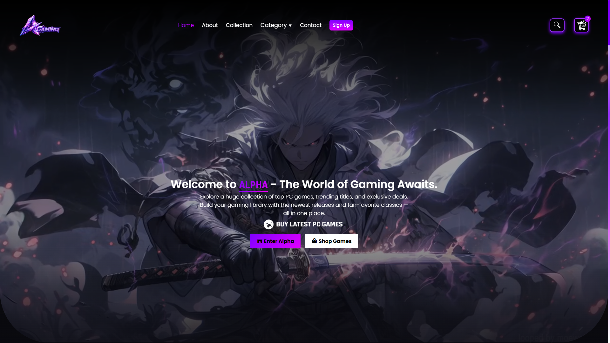
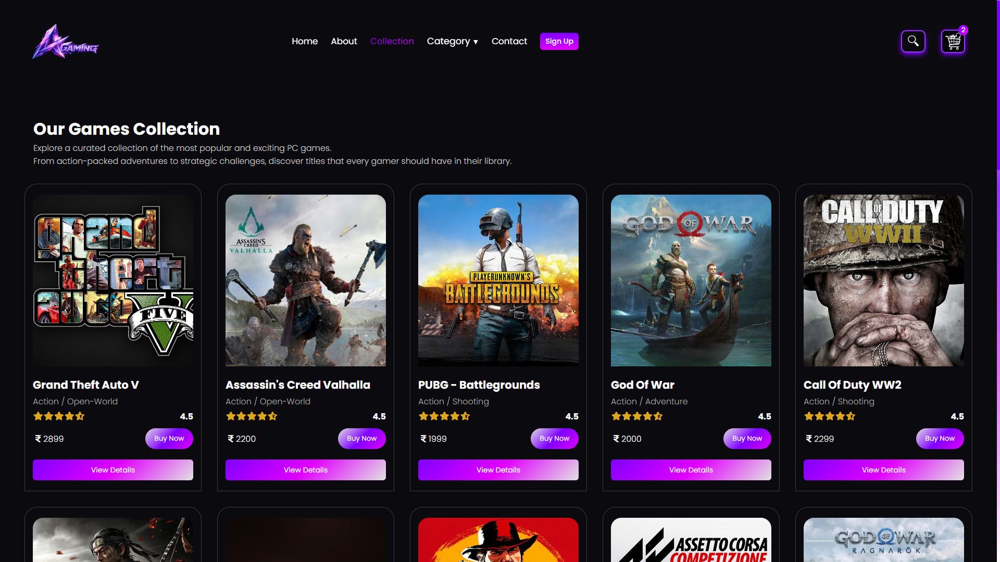
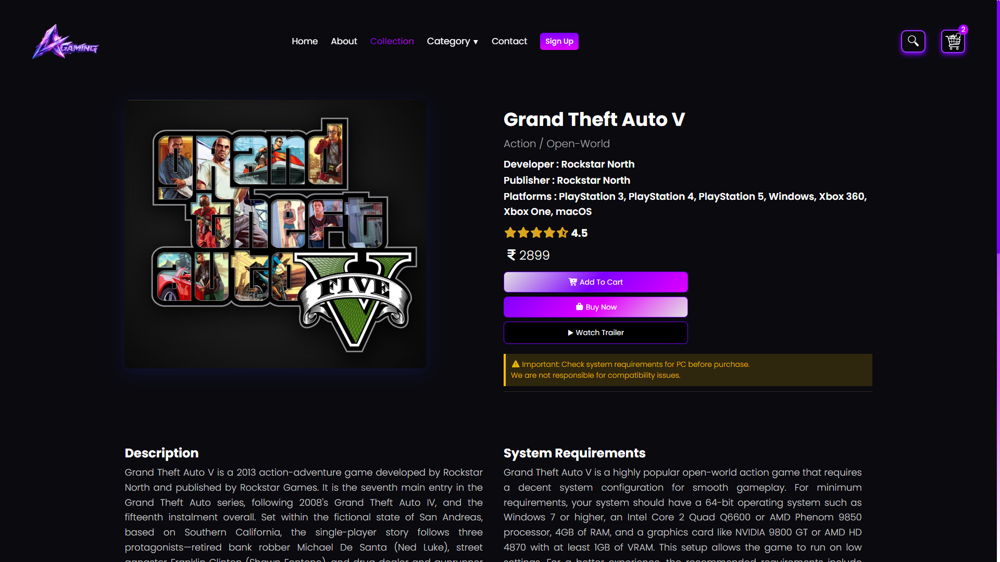
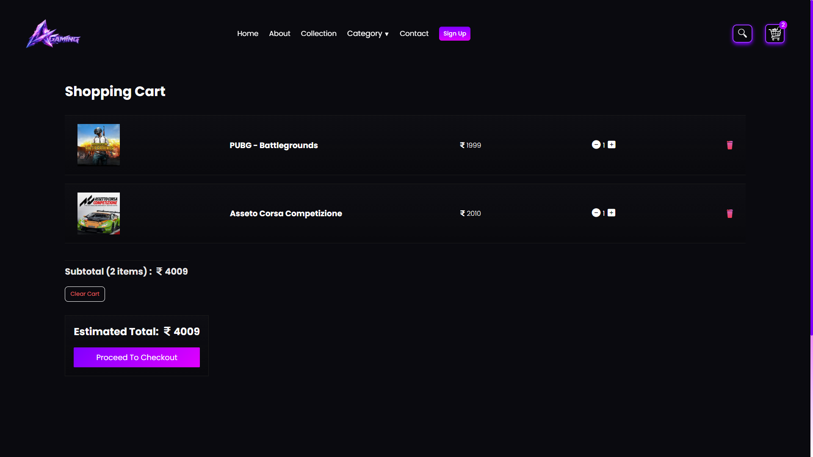
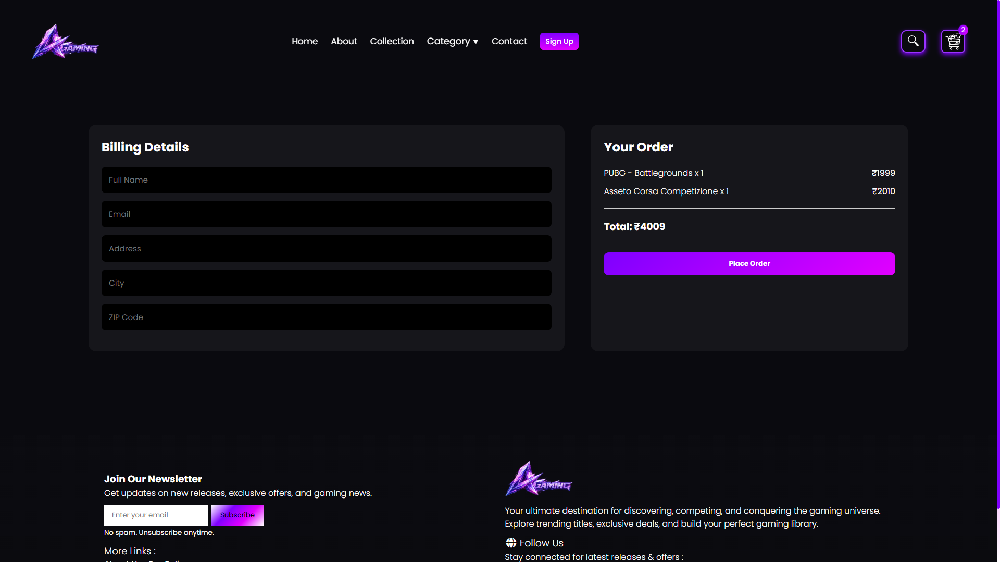
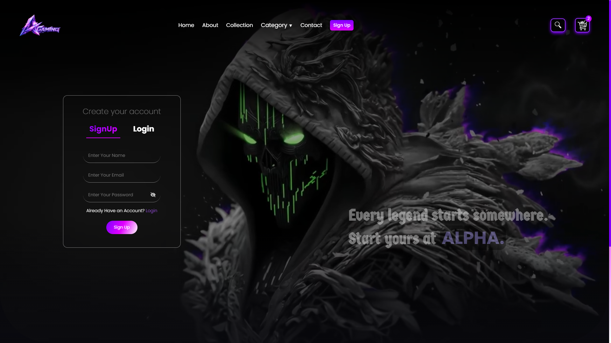
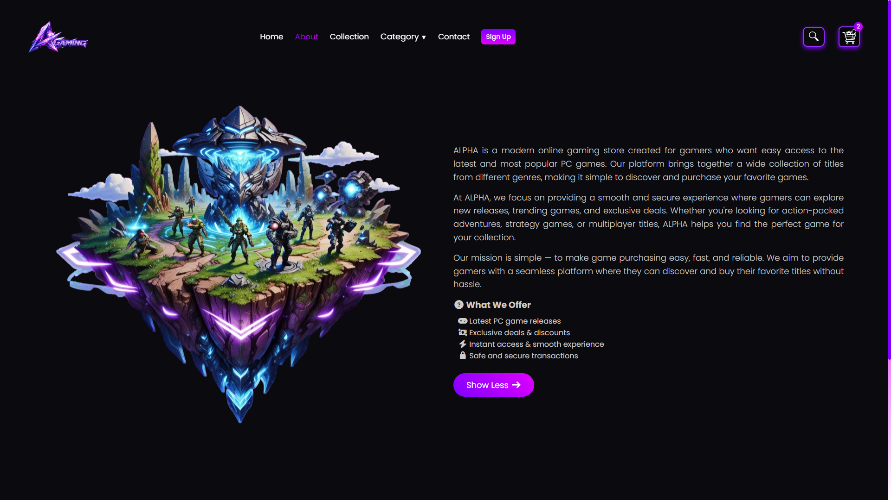
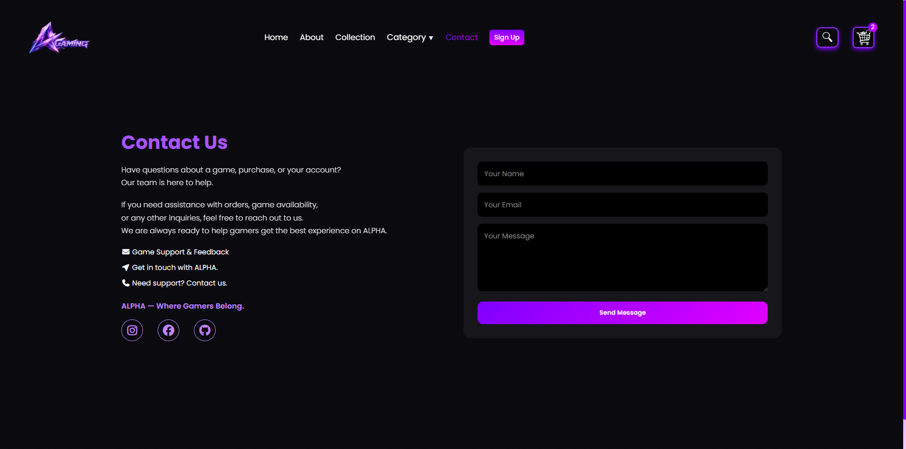

# 🎮 Alpha Gaming Store

An e-commerce web application for buying gaming products like consoles, accessories, and digital items.
Built with a modern full-stack architecture using React and Node.js.

---

## 🚀 Features

* 🔐 User Authentication (Signup / Login)
* 📧 Email Verification with OTP
* 🍪 Secure Authentication using JWT & Cookies
* 🛒 Add to Cart functionality
* 📱 Fully Responsive (Mobile + Desktop)
* 🔄 Real-time UI updates

---

## 🛠️ Tech Stack

### 🚀 Frontend


---

### 🧠 Backend


---

### 🔐 Authentication & Security


---

### 💳 Services


---

## 📂 Project Structure

```
alpha-gaming-store/
│
├── Frontend/       # React frontend
├── Backend/        # Node.js backend
├── .env            # Environment variables (ignored)
└── README.md
```

---

## ⚙️ Installation & Setup

### 1. Clone the repository

```
git clone https://github.com/abdullah-full-stack-dev/alpha-gaming-store.git
cd alpha-gaming-store
```

---

### 2. Install dependencies

#### Frontend

```
cd Frontend
npm install
npm start
```

#### Backend

```
cd Backend
npm install
npm start
```

---

## 🔐 Environment Variables

Create a `.env` file in the Backend folder:

```
PORT=5000
MONGO_URI=your_mongodb_connection
JWT_SECRET=your_secret_key

EMAIL_USER=your_email
EMAIL_PASS=your_smtp_key
```

---

## 🌐 Live Demo

👉 https://alpha-gaming-store.netlify.app/

---

## 📸 Screenshots

### 🏠 Home Page


### 📦 Collection Page


### 🎮 Game Details Page


### 🛒 Cart Page


### 💳 Checkout Page


---

### 💳 Authentication Page


---

### 📄 Additional Pages

### ℹ️ About Page


### 📞 Contact Page


---

## 👨‍💻 Author

* Abdullah Khan (Full Stack Web Developer)

---

## ⭐ Support

If you like this project, give it a ⭐ on GitHub!

---
